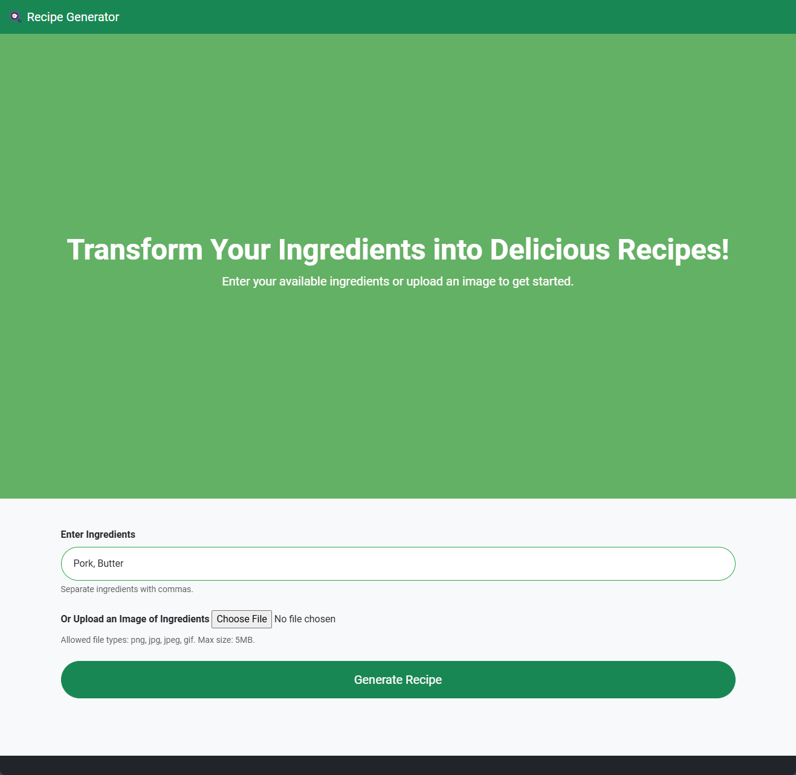
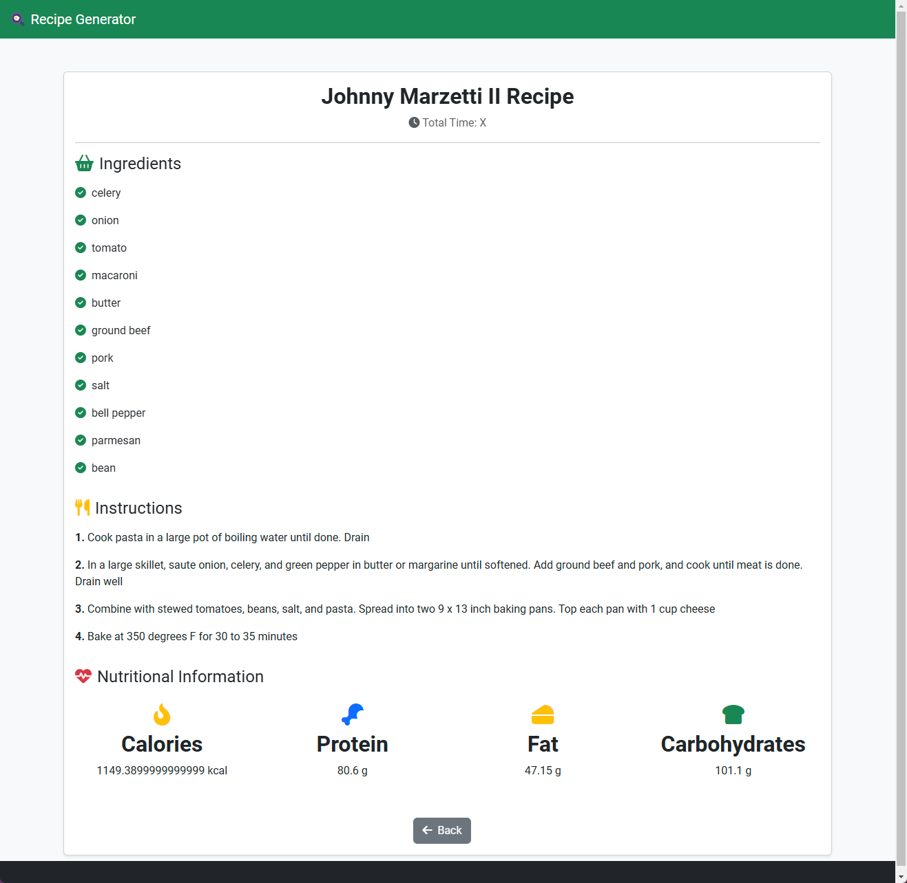

# Recipe Generator 🍳

## Table of Contents

- [About The Project](#about-the-project)
- [Features](#features)
- [Installation](#installation)
- [Usage](#usage)
- [Acknowledgements](#acknowledgements)

## About The Project

Transform your available ingredients into delicious and creative recipes with the **Recipe Generator**! Whether you're a seasoned chef or a beginner in the kitchen, this Flask-based web application helps you discover new dishes based on what you have on hand.




## Features

- **Ingredient Input**: Manually enter a list of ingredients to generate matching recipes.
- **Image Upload**: Upload a photo of your ingredients, and the app recognizes them to suggest recipes.
- **Nutritional Information**: Get detailed nutritional breakdowns for each recipe.

## Installation

1. **Clone the Repository**

    ```bash
    git clone https://github.com/verneylmavt/recipe-generator.git
    cd recipe-generator
    ```

2. **Create a Virtual Environment**

    It's good practice to use a virtual environment to manage project dependencies.

    ```bash
    python -m venv venv
    ```

3. **Activate the Virtual Environment**

    - **On Windows:**

        ```bash
        venv\Scripts\activate
        ```

    - **On Unix or MacOS:**

        ```bash
        source venv/bin/activate
        ```

4. **Install Dependencies**

    ```bash
    pip install -r requirements.txt
    ```

5. **Download NLP Models**

    The application uses NLTK and SpaCy for natural language processing. Download the required models:

    ```python
    python seyup_nlp.py
    ```

6. **Run the Application**

    ```bash
    flask run
    ```

    The application should now be accessible at `http://127.0.0.1:5000/`.

## Usage

1. **Home Page**

    - **Enter Ingredients**: Type in the ingredients you have, separated by commas.
    - **Or Upload Image**: Alternatively, upload an image containing your ingredients.

2. **Generate Recipe**

    - Click on the "Generate Recipe" button.
    - The app will process your input and display a recipe that matches your ingredients, including ingredients list, instructions, and nutritional information.

3. **Navigate**

    - Use the "Back" button on the recipe page to generate another recipe.

## Acknowledgements

- [Flask Documentation](https://flask.palletsprojects.com/)
- [Bootstrap Documentation](https://getbootstrap.com/)
- [Nutritionix API](https://www.nutritionix.com/business/api)
- [Font Awesome](https://fontawesome.com/)

